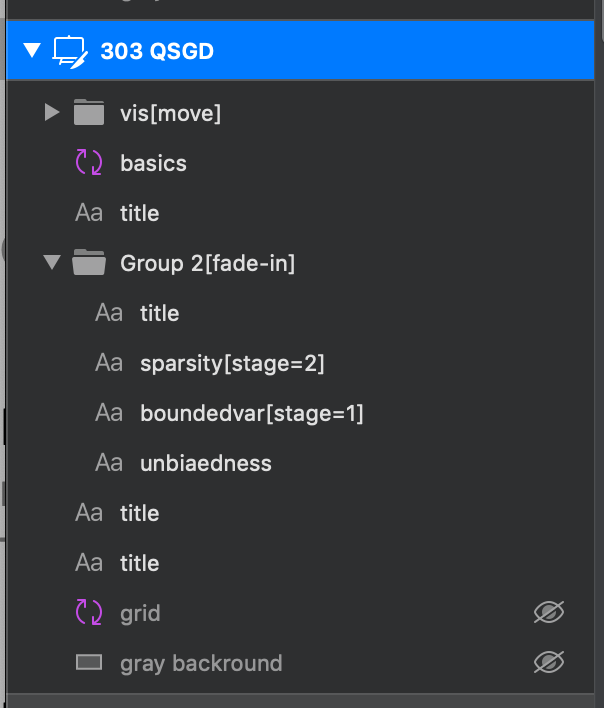

# SVG Slides

Slide crafting utility for nerds.

-   Expect this to be more work than PowerPoint or KeyNote
-   Use this if you want absolute control over slide transitions. 
    This basically supports magic move while you are in control over linking objects between slides.

## Process

-   You make slides in your favourite vector editor (I use Sketch on Mac)
-   Annotate ids with attributes, e.g. `myPath[fade-in]` or `rectangle[move][otherattrib=value]` (to enable magic move to the next or previous slide)
     Looks like this in [Sketch](https://www.sketch.com/): 
    

-   Run `./preprocess_slides.py demo-data/*.svg -o demo-data/slides.json` to pre-process your SVGs (parse these annotated ids) and turn them into one big JSON file. This also does things like stripping out embedded images and puting them in `/media/`
-   Run `parcel index.html` to serve your slides in dev-mode.
-   If images don't appear, you need to copy `media/` them to the `dist/` directory ...

## Step-wise appearance of nodes

-   Use tags like `[stage=1]` or `[stage=3-5]` in your IDs.

## Entry animation

-   `mynode[fade-in]`
-   `mynode[fade-in=2]` --- fade in, taking 2 seconds
-   `mynode[fade-in=0.5, 1]` --- fade in, taking 500ms, aligning this at the end of the transition if other transitions take longer
-   `mynode[draw-line]` --- for paths, draw them from start to finish
-   `mynode[appear-along=PathId,5,0]` --- appear along a given path object, take 5 seconds, align at the begining of the transition

## Transitioning objects from one stage to the next

-   `mynode[move=1.5]` --- 1.5 morph .. could be color, position, rotation, ... will be morphed

## Exit animation

-   `mynode[fade-out=1]` --- 1 second fade out

## External content

-   `rect[youtube=55bjCP9Fy5I]` will embed a YT video

## Shortcuts

-   `Left`, `Right`, `Up`, `Down`, `[`, `]` --- stage navigation
-   `Shift + Left` etc. --- navigation, skipping incremental builds
-   `Home`, `End` --- go to start or beginning
-   `G 10 G` -- go to slide number 10
-   `F` --- go full screen
-   `C` --- open the cockpit (presenter view). _move this to a separate window_
-   `T` --- start/stop the timer (visible in presenter view)
-   `R` --- reset the timer to zero
-   `B` --- toggle blacking out the slide
